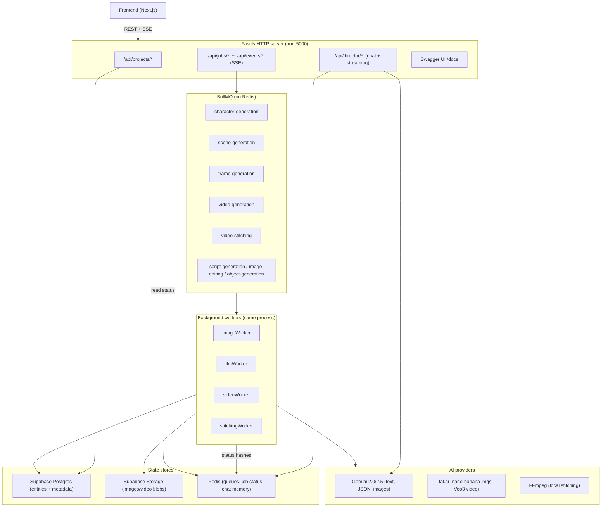
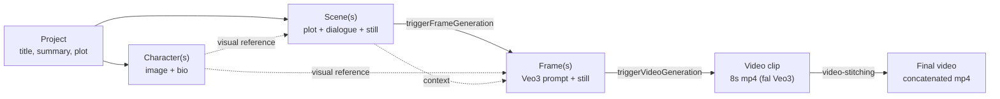
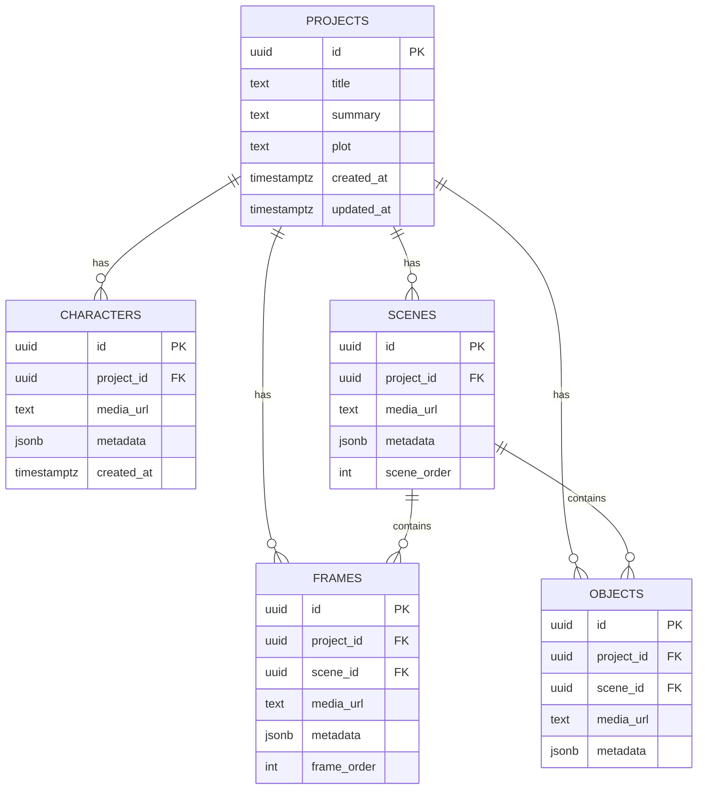
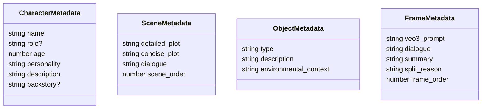
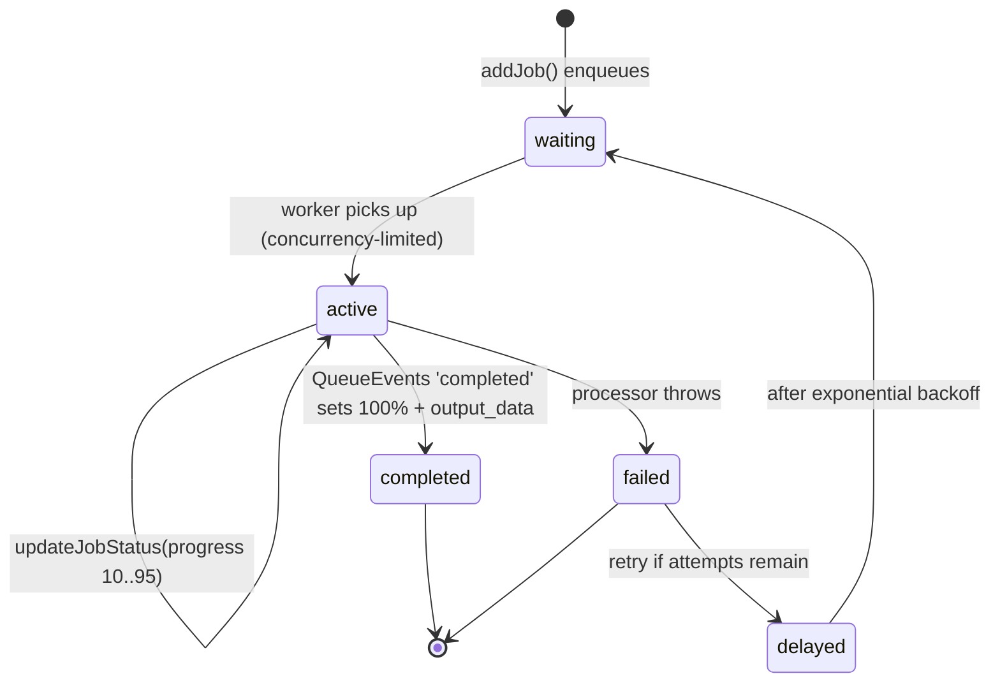
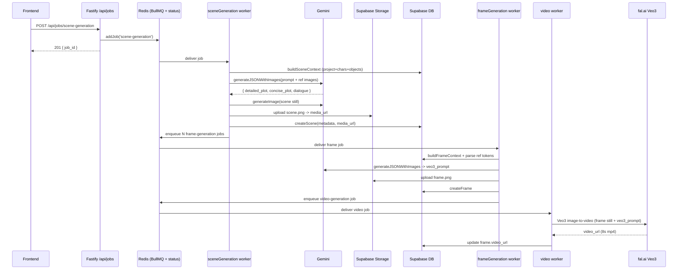
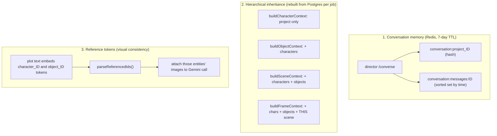
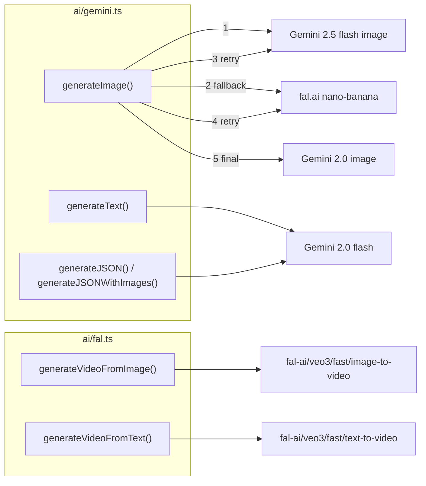
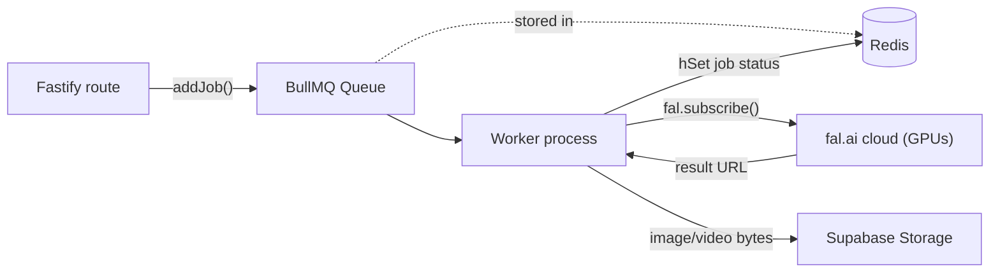
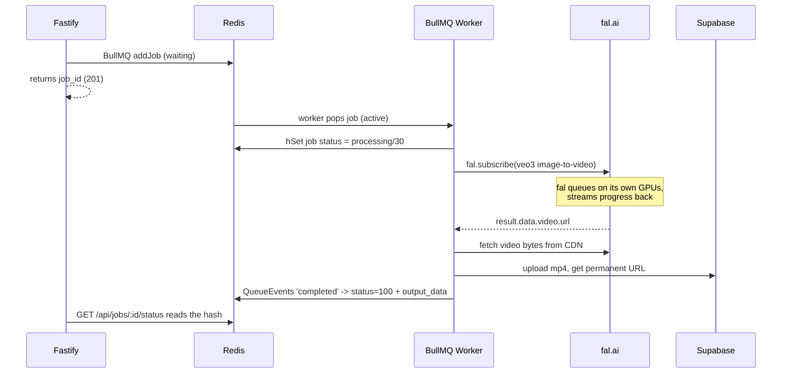

# Stu3dio Backend — Architecture & Technology Guide

> An end-to-end reference for how the AI Film Studio backend is built: the
> architecture, the data model, how metadata is stored, how context is
> preserved across the generation pipeline, and the core technologies
> (Redis, BullMQ, fal.ai) that make it work.
>
> This document is derived from a static read of `backend/src/**`,
> `backend/supabase/migrations/**`, and the route/worker/AI layers. Where a
> claim is inferred rather than observed at runtime, it is called out.

## Table of contents

1. [What this backend does](#1-what-this-backend-does)
2. [Tech stack](#2-tech-stack)
3. [High-level system map](#3-high-level-system-map)
4. [The content hierarchy](#4-the-content-hierarchy)
5. [Data model (ER + class diagrams)](#5-data-model-er--class-diagrams)
6. [What is actually stored — real JSON payloads](#6-what-is-actually-stored--real-json-payloads)
7. [Jobs & the queue pipeline](#7-jobs--the-queue-pipeline)
8. [Context preservation — the 3 mechanisms](#8-context-preservation--the-3-mechanisms)
9. [AI provider abstraction](#9-ai-provider-abstraction)
10. [Core technologies explained: Redis, BullMQ, fal](#10-core-technologies-explained-redis-bullmq-fal)
11. [Known issues & gotchas](#11-known-issues--gotchas)
12. [Directory map](#12-directory-map)

---

## 1. What this backend does

This is an **AI film studio**. A user describes a movie concept in a chat, and
the backend turns it into a finished, stitched-together video by walking down a
hierarchy:

```
Project -> Characters -> Scenes -> Frames -> Video clips -> Final cut
```

Every expensive step (LLM calls, image generation, video generation, stitching)
runs as an **asynchronous background job**. The HTTP layer is intentionally thin:
a request validates input, drops a job on a queue, and returns a `job_id`
immediately. The frontend then polls for status.

The entry point is `backend/src/index.ts` (`bootstrap()`), which boots services
in order: database -> Redis -> queues -> workers -> HTTP server.

---

## 2. Tech stack

| Layer | Technology |
|---|---|
| Runtime | Bun |
| HTTP server | Fastify (+ CORS, multipart, Swagger UI at `/docs`) |
| Job queue | BullMQ (on Redis) |
| In-memory store | Redis (queues, job status, chat memory) |
| Database | Supabase Postgres (entities + JSONB metadata) |
| Blob storage | Supabase Storage (bucket `htn2025`) |
| Text / JSON / images | Google Gemini (2.0 flash, 2.5 flash image) |
| Images (fallback) / video | fal.ai (`nano-banana`, Veo 3 fast) |
| Video stitching | FFmpeg (local, via `fluent-ffmpeg`) |
| Validation | Zod schemas (`models/schemas.ts`) |

---

## 3. High-level system map



**Key idea:** the HTTP layer is thin. A `POST /api/jobs/...` validates input,
enqueues a job on a Redis-backed queue, and returns a `job_id` (201). The real
work happens in workers, and the frontend **polls** `GET /api/jobs/:id/status`.

---

## 4. The content hierarchy

This is the domain model and the generation order. Each level **auto-triggers**
the next.



The cascade is implemented inside the workers:

- `processSceneGeneration` creates a scene row, then `triggerFrameGeneration(...)`
  enqueues N `frame-generation` jobs (`backend/src/workers/imageWorker.ts`).
- `processFrameGeneration` creates a frame row, then `triggerVideoGeneration(...)`
  enqueues a `video-generation` job.
- `video-stitching` is triggered separately, e.g. via
  `POST /api/projects/:id/confirm-video`.

The number of frames per scene is driven by `target_frames` (the screenwriter
prompt suggests a `3-2-3` structure, ~64s film).

---

## 5. Data model (ER + class diagrams)

### 5a. Database schema (Supabase Postgres)

Every creative entity has the **same shape**: identity columns + a freeform
`metadata` JSONB blob. That uniformity is what makes the model flexible.



Defined in `backend/supabase/migrations/`. Notes:

- `ON DELETE CASCADE` on all `project_id` / `scene_id` foreign keys.
- Row Level Security is enabled, but with allow-all policies (hackathon-grade).
- `media_url` has a `CHECK` constraint requiring an `http(s)://` URL when present.

### 5b. The metadata shapes (Zod, `models/schemas.ts`)

The `metadata` JSONB differs per entity. This is the answer to "how is metadata
stored": one JSONB column per row, validated in the app layer by Zod.



---

## 6. What is actually stored — real JSON payloads

> Values below are representative examples in the exact shapes the code produces.

### Project row (`projects`)

```json
{
  "id": "f47ac10b-58cc-4372-a567-0e02b2c3d479",
  "title": "Neon Drift",
  "summary": "A street racer uncovers a conspiracy in near-future Tokyo.",
  "plot": "- Kaito wins an illegal midnight race\n- He's handed a mysterious chip\n- The syndicate hunts him",
  "created_at": "2026-06-15T03:11:22.114Z",
  "updated_at": "2026-06-15T03:42:09.880Z"
}
```

### Character row (`characters`) — `metadata` is the JSONB blob

```json
{
  "id": "9b1deb4d-3b7d-4bad-9bdd-2b0d7b3dcb6d",
  "project_id": "f47ac10b-58cc-4372-a567-0e02b2c3d479",
  "media_url": "https://<proj>.supabase.co/storage/v1/object/public/htn2025/characters/char_1718_ab12.png",
  "metadata": {
    "name": "Kaito Nakamura",
    "role": "Protagonist",
    "age": 28,
    "personality": "Reckless but loyal; chases adrenaline to outrun grief.",
    "description": "Lean, mid-20s, cropped black hair, scarred eyebrow, red bomber jacket.",
    "backstory": "Former courier who lost his brother in a rigged race."
  },
  "created_at": "2026-06-15T03:20:00.000Z"
}
```

### Scene row (`scenes`) — note the reference tokens embedded in `detailed_plot`

```json
{
  "id": "3f2504e0-4f89-41d3-9a0c-0305e82c3301",
  "project_id": "f47ac10b-58cc-4372-a567-0e02b2c3d479",
  "media_url": "https://<proj>.supabase.co/storage/v1/object/public/htn2025/frames/scene_1718_zz.png",
  "metadata": {
    "detailed_plot": "<|character_9b1deb4d-3b7d-4bad-9bdd-2b0d7b3dcb6d|> revs his engine beside <|object_5c2e...|> as neon rain falls.",
    "concise_plot": "Kaito prepares for the midnight race.",
    "dialogue": "Kaito: This is the one that changes everything.",
    "scene_order": 0
  }
}
```

### Frame row (`frames`) — `video_url` is added later by the video worker

```json
{
  "id": "7c9e6679-7425-40de-944b-e07fc1f90ae7",
  "project_id": "f47ac10b-58cc-4372-a567-0e02b2c3d479",
  "scene_id": "3f2504e0-4f89-41d3-9a0c-0305e82c3301",
  "media_url": "https://<proj>.supabase.co/storage/v1/object/public/htn2025/frames/frame_1718_qq.png",
  "video_url": "https://v3.fal.media/files/.../output.mp4",
  "metadata": {
    "veo3_prompt": "Low-angle tracking shot of a red sports car, neon reflections, rain, cinematic, 8s.",
    "dialogue": "Kaito: This is the one.",
    "summary": "Kaito stages at the start line.",
    "split_reason": "Single continuous action fits in 8s.",
    "frame_order": 0
  }
}
```

### Media handling

Images and videos are **never** stored in Postgres. Workers generate a buffer,
upload it to **Supabase Storage** (bucket `htn2025`, folders `characters/`,
`scenes/`, `objects/`, `frames/`, `videos/`), and persist only the **public URL**
in `media_url` (`backend/src/utils/storage.ts`).

---

## 7. Jobs & the queue pipeline

### 7a. Job status is a Redis hash, not a Postgres table

There is **no `jobs` table**. A job's live state is a Redis hash at
`job:{id}:status` (`backend/src/utils/queue.ts`), and BullMQ holds the queue
itself.

Raw Redis hash:

```
HGETALL job:1f2a.../status
status        -> "completed"
progress      -> "100"
updated_at    -> "2026-06-15T03:25:01.000Z"
output_data   -> "{\"type\":\"character\",\"character_id\":\"9b1d...\"}"   (JSON string)
```

`GET /api/jobs/:id/status` parses it back to:

```json
{
  "status": "completed",
  "progress": 100,
  "updated_at": "2026-06-15T03:25:01.000Z",
  "output_data": {
    "type": "character",
    "character_id": "9b1deb4d-3b7d-4bad-9bdd-2b0d7b3dcb6d",
    "image_url": "https://<proj>.supabase.co/.../characters/char_1718_ab12.png",
    "character_data": { "name": "Kaito Nakamura", "role": "Protagonist", "age": 28 }
  },
  "error_message": null
}
```

### 7b. Job lifecycle (state machine)



Queue config (`backend/src/utils/queue.ts`): `attempts: 3`, exponential backoff
(2s base), `removeOnComplete: 50`, `removeOnFail: 20`, plus a per-queue
**priority** so characters run before scenes before frames before video before
stitching.

Worker concurrency (per `backend/src/workers/*`):

| Worker | Queue | Concurrency |
|---|---|---|
| characterGenerationWorker | character-generation | 10 |
| objectGenerationWorker | object-generation | 6 |
| sceneGenerationWorker | scene-generation | 6 |
| frameGenerationWorker | frame-generation | 10 |
| imageEditingWorker | image-editing | 6 |
| videoWorker | video-generation | 30 |
| stitchingWorker | video-stitching | 1 |
| llmWorker | script-generation | 4 |

### 7c. End-to-end sequence (one scene to its video)



---

## 8. Context preservation — the 3 mechanisms

The most important conceptual part of the system. Three distinct mechanisms are
often conflated; they are separate.



### Mechanism 1 — Conversation memory (Redis)

The director chat (`POST /api/director/converse`) keys everything by
`project_{project_id}`. Each turn:

1. loads prior messages + accumulated context,
2. injects them into the system prompt,
3. calls Gemini for structured JSON,
4. stores both the user and assistant messages, and **accumulates** plot /
   characters (it does not overwrite good data with empty data),
5. when `is_complete`, **persists the plot to the Postgres project row**.

Stored conversation context (Redis hash at `conversation:project_{id}`; all
values are strings):

```json
{
  "conversation_id": "project_f47ac10b-58cc-4372-a567-0e02b2c3d479",
  "user_concept": "a cyberpunk racing thriller",
  "preferences": "{}",
  "director_response": "Great—here's a tighter hook...",
  "suggested_questions": "[]",
  "character_suggestions": "[{\"name\":\"Kaito Nakamura\",\"role\":\"Protagonist\",\"age\":28}]",
  "plot_outline": "- Kaito wins a midnight race\n- He's handed a chip",
  "next_step": "Generate characters",
  "function_calls": "[]",
  "session_state": "active",
  "project_id": "f47ac10b-58cc-4372-a567-0e02b2c3d479",
  "created_at": "2026-06-15T03:10:00.000Z",
  "updated_at": "2026-06-15T03:18:00.000Z"
}
```

Messages are stored in a **sorted set** (`zAdd`, score = epoch ms), so history is
time-ordered and retrievable newest-first (`backend/src/utils/conversation.ts`):

```json
{
  "id": "b7e8c0a2-1f3d-4c5e-9a6b-2d4f6a8c0e1f",
  "conversation_id": "project_f47ac10b-58cc-4372-a567-0e02b2c3d479",
  "user_query": "make it more noir",
  "director_response": "",
  "context": { "project_id": "f47ac10b-58cc-4372-a567-0e02b2c3d479" },
  "timestamp": "2026-06-15T03:18:00.000Z"
}
```

### Mechanism 2 — Hierarchical context inheritance (Postgres)

Each generation job **re-reads the DB and rebuilds a context object** so the LLM
"remembers" parent entities. The deeper the level, the more it inherits
(`backend/src/utils/context.ts`):

| Builder | project summary/plot | characters | objects | current scene |
|---|---|---|---|---|
| `buildCharacterContext` | yes | - | - | - |
| `buildObjectContext` | yes | yes | - | - |
| `buildSceneContext` | yes | yes | yes | - |
| `buildFrameContext` | yes | yes | yes | yes |

The `HierarchicalContext` object is flattened into a prompt string by
`formatContextForPrompt`. Example object:

```json
{
  "project_summary": "A street racer uncovers a conspiracy...",
  "plot": "- Kaito wins a midnight race ...",
  "characters": [
    { "id": "9b1deb4d-...", "name": "Kaito Nakamura", "description": "...", "personality": "...", "media_url": "https://.../char.png" }
  ],
  "objects": [
    { "id": "5c2e...", "type": "sports car", "description": "...", "environmental_context": "...", "media_url": "https://.../obj.png" }
  ],
  "scenes": [
    { "id": "3f2504e0-...", "detailed_plot": "...", "concise_plot": "..." }
  ]
}
```

becomes:

```text
Project: A street racer uncovers a conspiracy...
Plot: - Kaito wins a midnight race ...

Characters:
- <|character_9b1deb4d-...|> Kaito Nakamura: ... (Reckless but loyal)

Objects/Environment:
- <|object_5c2e...|> sports car: ... (rain-soaked alley)
```

### Mechanism 3 — Reference tokens for visual consistency

The glue. When the LLM writes a scene or frame, it embeds stable IDs as tokens
like `<|character_9b1deb4d-...|>` directly in the prose. Downstream:

- `parseReferencedIds()` regex-extracts those IDs (`backend/src/utils/context.ts`),
- the worker filters context to **only** the referenced characters/objects,
- and attaches **their stored images** to the Gemini call via
  `generateJSONWithImages(...)` so the new still stays visually consistent with
  the established look (`backend/src/workers/imageWorker.ts`,
  `backend/src/ai/gemini.ts`).

So context flows: **chat -> plot (Postgres) -> token-laced scene text -> frames
pull the right reference images -> Veo3 animates the matching still.**

---

## 9. AI provider abstraction



- **Image generation** has a robust 5-step fallback chain across Gemini and fal
  (`backend/src/ai/gemini.ts`).
- **JSON generation** uses Gemini's native `responseSchema` for guaranteed
  structure.
- **Video** is always fal.ai Veo 3 fast: 8s, 16:9, 720p, with audio
  (`backend/src/workers/videoWorker.ts`).
- **Stitching** is local FFmpeg (`backend/src/ai/ffmpeg.ts`).

---

## 10. Core technologies explained: Redis, BullMQ, fal

### One-line mental model

- **Redis** = an ultra-fast in-memory data store. The shared scratchpad.
- **BullMQ** = a job queue library that runs **on top of Redis**. The
  **internal** task system.
- **fal (fal.ai)** = an **external** cloud service that runs the actual AI models
  (images, video) over an API. It has its **own** queue.

There is a queue inside a queue: a BullMQ job runs in a worker, and that worker
calls fal, which queues the work on fal's GPUs and returns a result URL.



### Redis — the in-memory data store

**What it is:** a single-threaded, in-memory key-value database. Because data
lives in RAM and the protocol is tiny, operations take microseconds. It supports
rich data structures (hashes, lists, sets, sorted sets, streams), TTLs, and
pub/sub. It can persist to disk but is frequently used as ephemeral state.

**How it works:** you connect over TCP (default port `6379`) and issue commands
like `SET`, `HSET`, `ZADD`. Single-threaded execution means each command is
atomic without locks.

**How this repo uses it — three separate jobs:**

1. **Backing store for BullMQ** — the queues live here, configured via
   `queueConnection` in `backend/src/utils/queue.ts`.
2. **Job status mirror** — a hash per job at `job:{id}:status`
   (`hSet` / `hGetAll`).
3. **Conversation memory for the director chat** (`utils/conversation.ts`),
   using three structures:
   - **Hash** `conversation:{id}` — the accumulated context.
   - **Sorted set** `conversation:messages:{id}` — chat history scored by
     timestamp (`zAdd` / `zRange`).
   - **Set** `conversations:index` — index of all conversation IDs.
   - All with a **7-day TTL** (`expire`, `604800` seconds).

Note: the repo opens **two** Redis connections — a `node-redis` client from
`initRedis()` for the status/conversation commands, and BullMQ's own connection
from the `{ host, port, db }` config object. Same server, two clients.

### BullMQ — the job queue (built on Redis)

**What it is:** a Node.js library for background job processing. You enqueue a
"job" from one place (the API), and a "worker" processes it elsewhere
(potentially later, potentially in parallel). It is the modern successor to Bull.

**Why it's needed:** generating an image or an 8-second video takes seconds to
minutes; an HTTP request cannot wait that long. The route enqueues and returns a
`job_id`; the work happens in the background.

**Core concepts, all used here:**

| Concept | Role | In this code |
|---|---|---|
| `Queue` | Producer side — add jobs | `createQueues()`, `addJob()` |
| `Worker` | Consumer side — process jobs | `new Worker(name, processor, {concurrency})` |
| `Job` | One unit of work: data + lifecycle | the `jobData` object with `input_data` |
| `QueueEvents` | Listen to global events | `'completed' / 'failed' / 'progress'` |

**How it works under the hood:** BullMQ stores each job as a hash in Redis and
tracks state by moving the job ID between Redis structures
(`waiting` -> `active` -> `completed`/`failed`, plus `delayed` for retries).
Workers do a blocking pop to grab the next job; moves are atomic via Lua scripts,
so two workers never grab the same job. If a worker crashes mid-job, BullMQ's
stalled-job detection re-queues it.

**Two project-specific design choices:**

- The repo **mirrors BullMQ's events into its own `job:{id}:status` hash** so the
  API can return a simple `{ status, progress, output_data }` shape instead of
  querying BullMQ internals.
- The cascade (scene -> frames -> video) is done by calling `addJob()` **inside**
  workers, not with BullMQ's built-in `FlowProducer` parent/child flows. It is a
  manual fan-out.

### fal (fal.ai) — the external AI model runner

**What it is:** a serverless inference platform for generative AI. You do not own
GPUs or host models — you call a hosted endpoint by name (e.g.
`fal-ai/nano-banana`, `fal-ai/veo3/fast/image-to-video`), pass an input, and get
back a result. fal runs Google's Veo 3 video model and the nano-banana image
model, among many others.

**How it works (the pattern used here, `ai/fal.ts` + `ai/gemini.ts`):**

1. **Auth:** `fal.config({ credentials: FAL_KEY })`.
2. **Upload inputs if needed:** `fal.storage.upload(file)` returns a URL — used to
   feed a source image into image-to-video or image editing.
3. **Run the model:** `fal.subscribe(endpoint, { input })` — submits the job to
   fal's own queue and **waits**, streaming progress via `onQueueUpdate` until the
   model finishes, then returns `result.data`.
4. **Read the output:** results come back as **URLs** on fal's CDN
   (`result.data.images[0].url`, `result.data.video.url`, hosted at
   `v3.fal.media`). This backend then downloads those bytes and re-uploads them
   to Supabase Storage so it controls the permanent copy.

An async pattern also exists (`fal.queue.submit` -> `request_id` ->
`fal.queue.status` / `fal.queue.result`, with optional webhooks); helpers for it
exist (`generateVideoAsync`, `getVideoResult`) but the **active path uses the
blocking `subscribe`**.

**Endpoints this repo calls:**

- `fal-ai/nano-banana` — text to image (image fallback in the Gemini chain).
- `fal-ai/nano-banana/edit` — image editing.
- `fal-ai/veo3/fast/image-to-video` — the main video generator (8s/720p/16:9 + audio).
- `fal-ai/veo3/fast/text-to-video` — text-only fallback.

**The "queue inside a queue":** because `fal.subscribe` blocks until the model
finishes, a single BullMQ `video-generation` worker slot is held for the whole
Veo 3 runtime. That is why the video worker concurrency is high (30) — most of
that time is spent waiting on fal, not using local CPU.

### Putting it together — "generate one scene's video"



- **Redis** holds the queue and the live status.
- **BullMQ** orchestrates internal work (retries, concurrency, priority, events).
- **fal** does the actual AI compute and returns a URL.

---

## 11. Known issues & gotchas

These materially affect behavior and are worth knowing before building on top of
the backend. Confidence reflects static analysis only (not a live run).

1. **Two workers listen on the same `frame-generation` queue.** Both
   `imageWorker.frameGenerationWorker` (concurrency 10) and
   `llmWorker.frameWorker` (concurrency 8) are registered. BullMQ hands each frame
   job to whichever is free, but only the imageWorker version creates the DB row,
   image, and triggers video; the llmWorker version only returns metadata and does
   nothing downstream. This is a real race/inconsistency. **Confidence: 90%.**

2. **`scene-script-generation` worker is dead.** `llmWorker.sceneWorker` listens
   on a queue that is never created and never receives jobs. Harmless dead code.
   **Confidence: ~85%.**

3. **The SSE progress endpoints do not work.**
   `/api/events/project/:id/characters|scenes|videos` scan Redis keys like
   `job:character-generation:{project}:*` with `redis.get`, but job status is
   written at `job:{id}:status` via `hSet`. The patterns never match, so these
   streams emit only `connected` plus empty batches. The working mechanism is
   polling `GET /api/jobs/:id/status`. **Confidence: ~85%.**

4. **`video_url` and `final_video_url` columns are not in any migration.**
   `videoWorker` writes `frames.video_url` and `stitchingWorker` writes
   `projects.final_video_url`, but no committed migration defines them. If the live
   DB lacks them, those writes silently fail (both call sites catch and log), and
   `GET /api/projects/:id/complete` reading `frame.video_url` would always be
   falsy. The production DB may have been altered manually outside migrations.
   **Confidence: 75%.**

5. **No Gemini key cycling despite the README.** The README claims "API Key
   Cycling" with `GEMINI_API_KEYS` (plural). The code reads a single
   `process.env.GEMINI_API_KEY`; no cycling exists. **Confidence: 95%.**

6. **`/api/director/stream` only stores the user message**, never the assistant
   reply, and only when a `conversation_id` is passed in context. The richer,
   working chat path is `/api/director/converse`. **Confidence: 90%.**

7. **Security posture is hackathon-grade:** CORS `*`, RLS allow-all, the Supabase
   anon key used server-side, debug endpoints (`/api/debug/...`), and a destructive
   `DELETE /api/redis/clear` are exposed. Fine for a demo, not production.
   **Confidence: 95%.**

---

## 12. Directory map

```text
backend/
├── src/
│   ├── index.ts              # bootstrap: db -> redis -> queues -> workers -> http
│   ├── server.ts             # Fastify instance, CORS, Swagger, health, error handlers
│   ├── models/
│   │   └── schemas.ts        # Zod schemas + inferred types (Project, Character, ...)
│   ├── routes/
│   │   ├── projects.ts       # CRUD + per-entity metadata edits + /complete
│   │   ├── jobs.ts           # enqueue jobs, job status, queue status, SSE events
│   │   └── director.ts       # AI director chat (/converse) + streaming (/stream)
│   ├── workers/
│   │   ├── index.ts          # initAllWorkers() wires everything up
│   │   ├── imageWorker.ts    # character/object/scene/frame image gen + cascade
│   │   ├── llmWorker.ts      # script/plot/scene/frame text generation
│   │   ├── videoWorker.ts    # fal.ai Veo 3 video generation
│   │   └── stitchingWorker.ts# FFmpeg concatenation -> final video
│   ├── ai/
│   │   ├── gemini.ts         # text/JSON/image gen with multi-provider fallback
│   │   ├── fal.ts            # fal.ai video + upload helpers
│   │   └── ffmpeg.ts         # local stitching
│   └── utils/
│       ├── database.ts       # Supabase client + entity CRUD
│       ├── storage.ts        # Supabase Storage upload helpers + StorageConfigs
│       ├── queue.ts          # Redis + BullMQ queues, addJob, job status, events
│       ├── context.ts        # hierarchical context builders + reference tokens
│       └── conversation.ts   # Redis-backed director chat memory
└── supabase/
    └── migrations/           # projects/characters/scenes/objects/frames schema
```

---

*Generated as a static-analysis reference. Runtime behavior (especially the
Known Issues section) was inferred from source, not observed live.*
