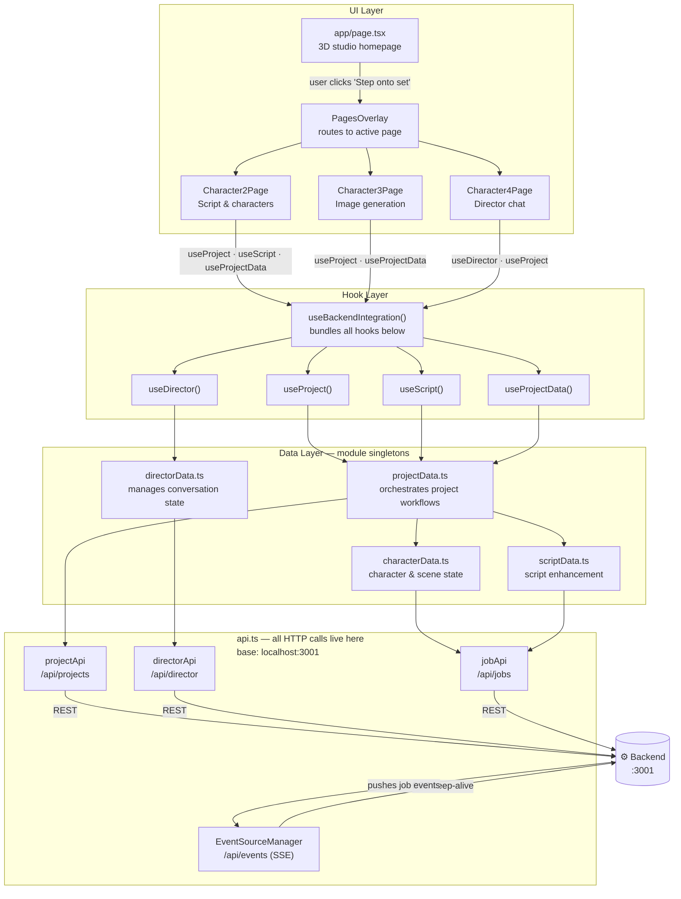
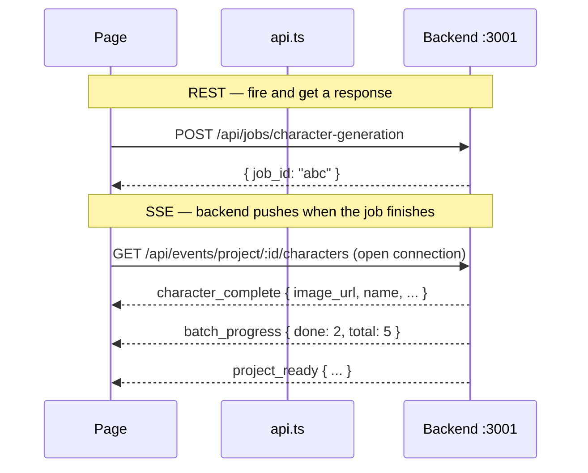
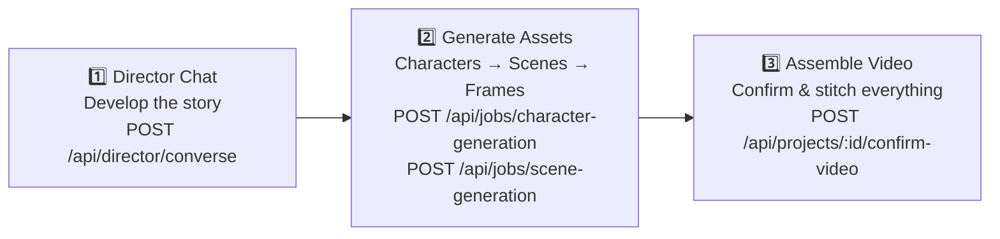

# Frontend Architecture — REST + SSE

## The Call Chain

Every user action flows through four layers before hitting the backend.

---

## REST vs SSE

SSE means the frontend never polls — the backend notifies it the moment a job completes.

---

## The Three Production Workflows

---

## Key Files at a Glance

| File | Role |
|---|---|
| `utils/api.ts` | Single source of all `fetch()` calls; exports `projectApi`, `directorApi`, `jobApi`, `contentApi`, `EventSourceManager` |
| `hooks/useBackendIntegration.ts` | Main hook consumed by pages; bundles project, director, script, data, and image-editing hooks |
| `data/projectData.ts` | Top-level workflow orchestrator; on `setActiveProject` it loads conversations, script, and characters in parallel |
| `store/backendStore.ts` | Zustand store holding `apiBaseUrl`, `projectId`, `conversationId` globally |
| `data/characterData.ts` | Holds character/scene state; calls `jobApi` to kick off generation jobs |
