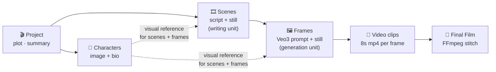
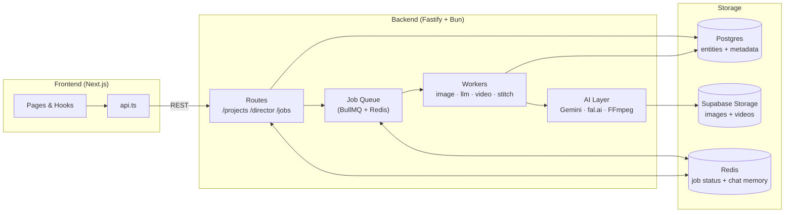
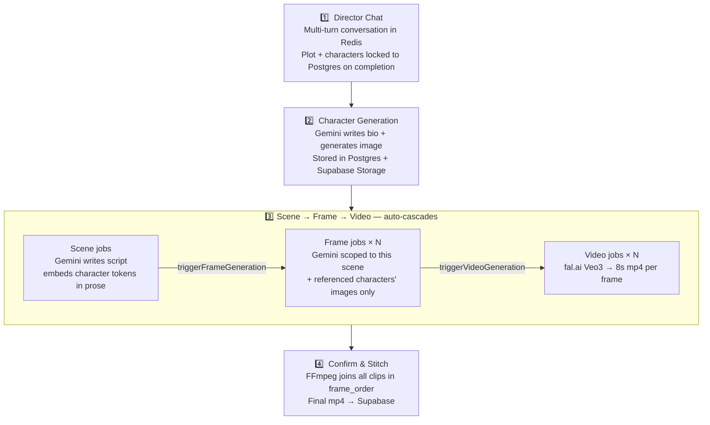
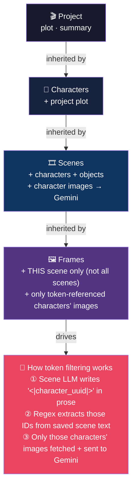

# System Architecture

## Content Hierarchy

Everything in the project flows down this hierarchy. Each level is generated from the one above it and inherits its context.

---

## Full Stack Overview

---

## Production Pipeline

---

## Context Inheritance — How Coherence Is Maintained

Each level only loads the context it needs. The reference token system ensures frames only pull in the characters actually present in their scene — not every character in the project.

